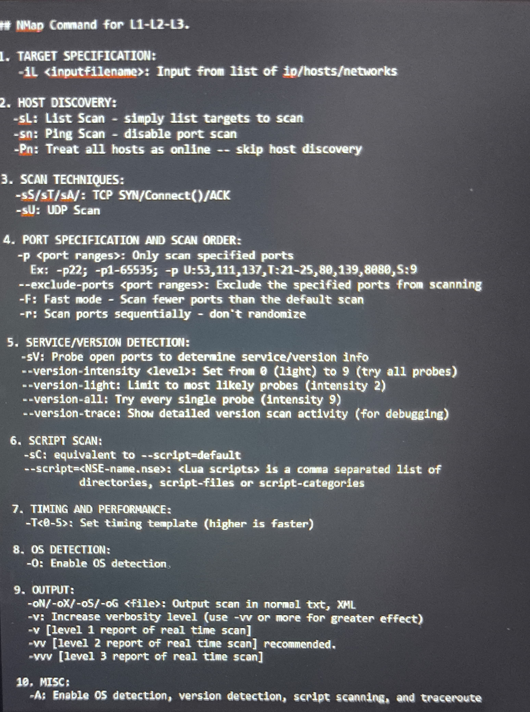

# 🛡️ Cybersecurity – Day 06

## 📌 Nmap `--help` Command

The `nmap --help` command shows all the available options, arguments, and examples to use the Nmap tool effectively.

### 🔍 Example Output:

```bash
nmap --help
```

This will display all options like:
- `-sS` : TCP SYN scan
- `-sU` : UDP scan
- `-A`  : Enables OS detection, version detection, script scanning, and traceroute
- `-p`  : Specify port range
- `-oN`, `-oX`, `-oG` : Output options

### 📸 Screenshot of `nmap --help` output:



---

## 🐳 What is Docker?

**Docker** is an open platform for developing, shipping, and running applications inside containers. Containers allow you to package an application with all its dependencies and run it anywhere.

### 🔧 Pulling Images using Docker

To pull a Linux image like Ubuntu or Kali:

```bash
# Pull Ubuntu image
docker pull ubuntu

# Pull Kali Linux image
docker pull kalilinux/kali-linux-docker
```

To run the image:

```bash
docker run -it ubuntu
docker run -it kalilinux/kali-linux-docker
```

---

## 📈 Uptime Kuma – Self-Hosted Monitoring Tool

**Uptime Kuma** is an open-source monitoring tool like "Uptime Robot", but self-hosted. It lets you track the status of websites, servers, and other services and get alerts when they go down.

### 🔍 Features:
- Beautiful web UI
- HTTP(s)/TCP/Ping monitoring
- Notification alerts (Telegram, Discord, Email, etc.)
- Multi-user support

### 🚀 Install Using Docker

```bash
docker run -d --restart=always -p 3001:3001 \
-v uptime-kuma:/app/data \
louislam/uptime-kuma
```

Then visit: `http://localhost:3001`

---

## 🌍 MaxMind – Geolocation IP Intelligence

**MaxMind** provides IP geolocation and fraud detection tools.

### 🔧 Use of MaxMind:
- Determine the country, region, city, ISP of an IP address.
- Used in cybersecurity for tracking attackers, geo-blocking, and analytics.

### 📥 How to Use:
1. Create an account at [MaxMind](https://www.maxmind.com/)
2. Download the **GeoLite2** database (free) or **GeoIP2** (paid).
3. Use with command-line tools or integrate into apps using Python, Node.js, etc.

---

## ✅ Conclusion

In Day-06 of our cybersecurity journey, we explored essential tools and platforms that are widely used in real-world security practices:

- **Nmap** equips us with powerful scanning capabilities to analyze networks and detect open ports, services, and vulnerabilities.
- **Docker** helps in containerizing environments, allowing us to run different operating systems like Ubuntu and Kali Linux easily for testing and development.
- **Uptime Kuma** provides an efficient self-hosted solution for monitoring the availability of services and websites, making it ideal for maintaining server uptime.
- **MaxMind** offers accurate geolocation services that can enhance security monitoring by tracking the origin of IP addresses.

These tools not only enhance our technical skills but also build a strong foundation for real-world cybersecurity tasks like reconnaissance, monitoring, analysis, and incident response.
